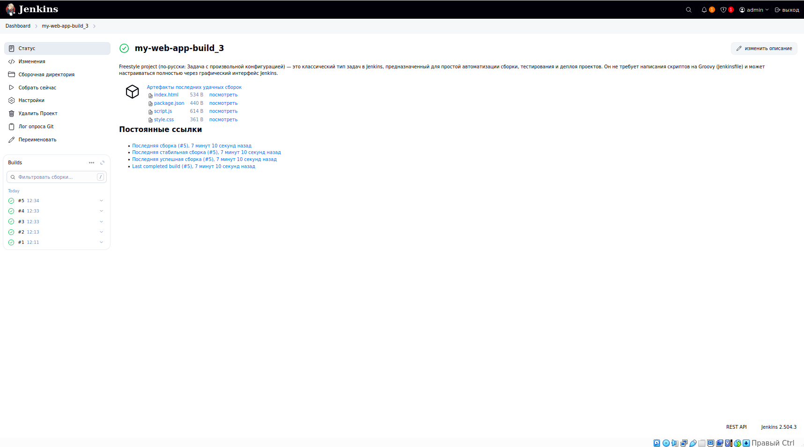
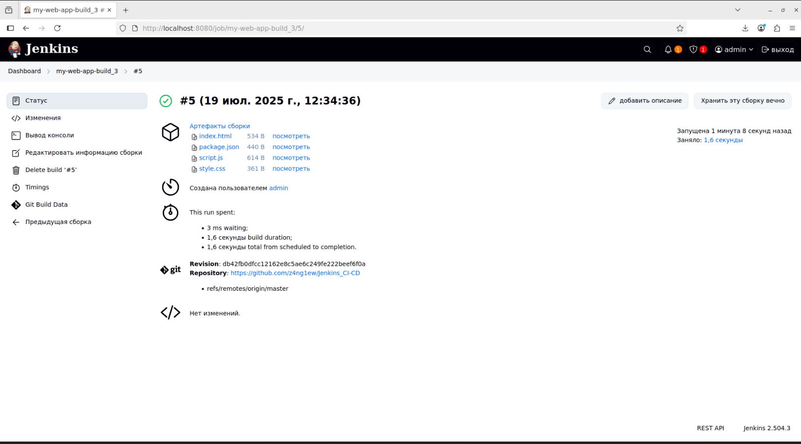
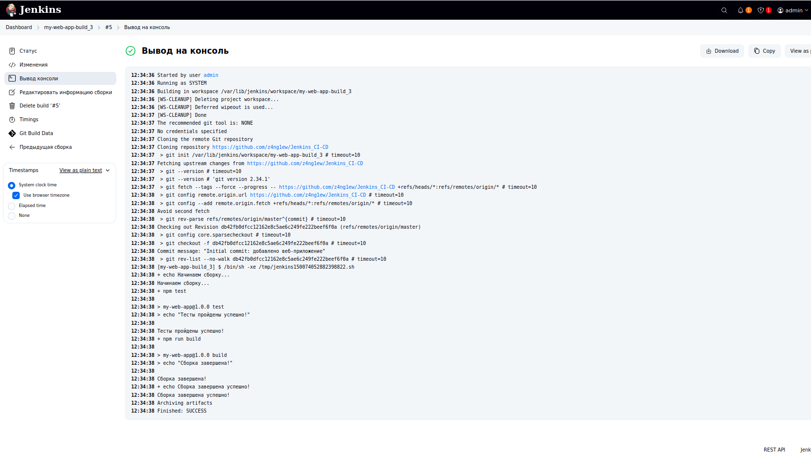

# Jenkins CI/CD Demo Project 🚀


## 📋 Описание проекта

**Русский**: Демонстрационный проект автоматизации CI/CD с помощью Jenkins. Включает простое веб-приложение с автоматической сборкой, тестированием и развертыванием. Показывает основы настройки Jenkins Job, работы с Git интеграцией и создания pipeline.

**English**: Demonstration CI/CD automation project using Jenkins. Includes a simple web application with automatic build, testing, and deployment. Shows the basics of Jenkins Job setup, Git integration, and pipeline creation for DevOps workflows.

## 🛠️ Структура проекта

```
Jenkins_CI-CD/
├── img/                      # Скриншоты и изображения
│   ├── artifacts.png         # Артефакты сборки
│   ├── despription.png       # Описание проекта
│   └── terminal.png          # Вывод терминала
├── index.html               # Главная страница приложения
├── package.json            # Конфигурация npm и скрипты
├── script.js              # JavaScript логика
├── style.css             # Стили CSS
└── README.md            # Документация проекта
```

## 🎯 Особенности проекта

- ✅ **Freestyle Project** - классическая задача Jenkins с графической настройкой
- ✅ **Автоматическая сборка** - запуск по расписанию и изменениям в Git
- ✅ **Артефакты** - сохранение файлов сборки для последующего использования
- ✅ **Интеграция с Git** - автоматическое получение изменений из репозитория
- ✅ **Веб-интерфейс** - простое HTML/CSS/JS приложение для демонстрации

## 📸 Скриншоты

### Описание проекта в Jenkins


### Артефакты успешной сборки


### Вывод терминала


## 🚀 Быстрый старт

### Предварительные требования
- Jenkins (версия 2.0+)
- Git
- Node.js (для npm скриптов)
- Веб-браузер

### Установка и запуск

1. **Клонирование репозитория**
```bash
git clone https://github.com/your-username/jenkins-ci-cd-demo.git
cd jenkins-ci-cd-demo
```

2. **Создание Jenkins Job**
- Откройте Jenkins Dashboard
- Создайте новый "Freestyle project"
- Настройте Source Code Management (Git)
- Добавьте Build Steps:
  ```bash
  echo "Начинаем сборку..."
  npm test
  npm run build
  echo "Сборка завершена успешно!"
  ```

3. **Настройка артефактов**
- В Post-build Actions добавьте "Archive the artifacts"
- Укажите файлы: `*.html, *.css, *.js`

4. **Запуск сборки**
- Нажмите "Build Now" или настройте автоматические триггеры

## 📋 Доступные npm скрипты

```bash
npm test    # Запуск тестов (демонстрационный)
npm run build    # Сборка проекта
npm start   # Запуск локального сервера на порту 3000
```

## 🔧 Настройки Jenkins Job

### Build Triggers
- **Poll SCM**: `H/5 * * * *` (проверка каждые 5 минут)
- **Build periodically**: по расписанию
- **GitHub hook trigger**: автоматический запуск при push

### Post-build Actions
- Архивирование артефактов
- Email уведомления
- Slack уведомления (опционально)

## 📊 Результаты сборки

Последние сборки показывают стабильную работу pipeline:

| Build | Status | Time | Artifacts |
|-------|--------|------|-----------|
| #7 | ✅ Success | 12:52 | 4 files |
| #6 | ✅ Success | 12:50 | 4 files |
| #5 | ✅ Success | 12:34 | 4 files |

## 🎓 Изученные концепции

- **Jenkins Job** - основная единица автоматизации
- **Build Triggers** - события для запуска сборки
- **Artifacts** - файлы результата сборки
- **SCM Integration** - работа с системами контроля версий
- **Post-build Actions** - действия после сборки

## 🚀 Следующие шаги

1. **Pipeline as Code** - переход на Jenkinsfile
2. **Multi-branch Pipeline** - работа с разными ветками
3. **Docker Integration** - контейнеризация приложения
4. **Automated Testing** - добавление реальных тестов
5. **Production Deployment** - автоматический деплой

## 📝 Полезные ссылки

- [Jenkins Documentation](https://www.jenkins.io/doc/)
- [Pipeline Syntax](https://www.jenkins.io/doc/book/pipeline/syntax/)
- [Git Plugin](https://plugins.jenkins.io/git/)
- [Build Pipeline Plugin](https://plugins.jenkins.io/build-pipeline-plugin/)

